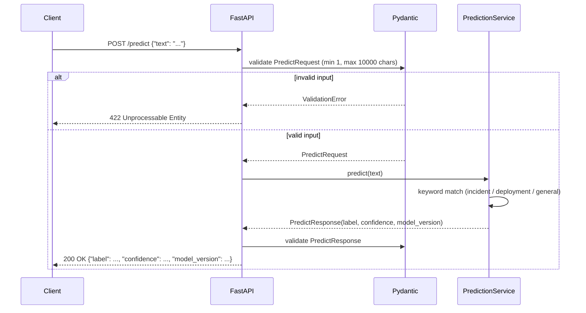
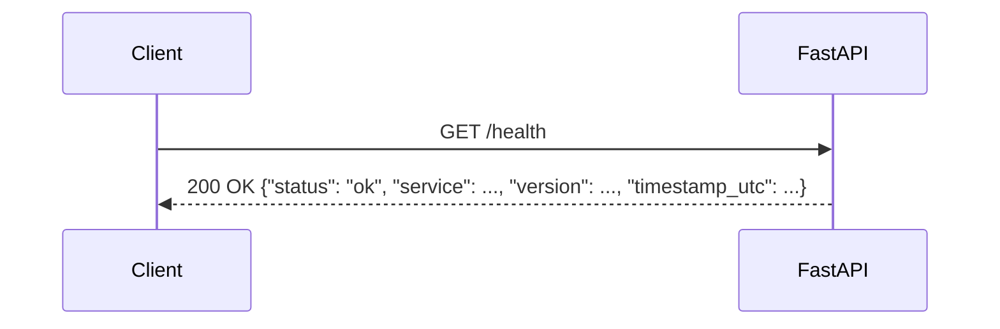
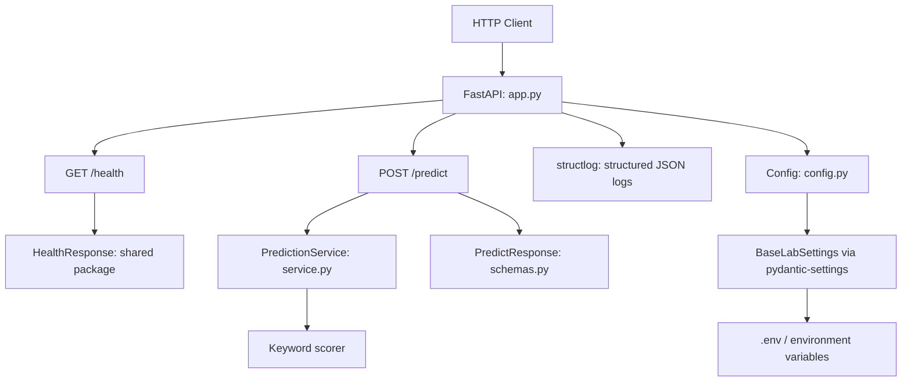
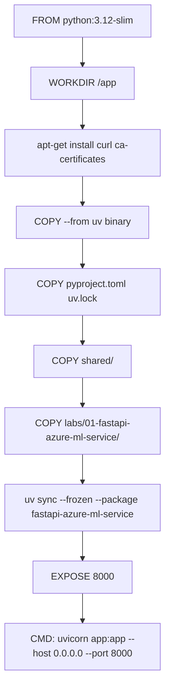
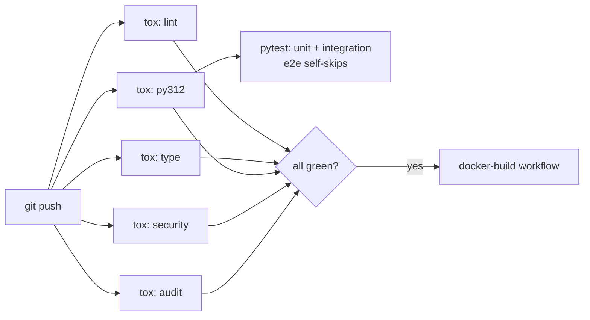

# Lab 01: Architecture and Technology Guide

This document explains how the service is structured, why each technology was chosen, and how to run and test it locally with Docker.

## What this lab proves

A production-shaped HTTP prediction service built with FastAPI, containerized with Docker, and deployable to Azure Container Apps. The service classifies text into incident, deployment, or general categories using a deterministic rule-based scorer. The scorer is intentionally simple so the lab stays focused on the API contract, containerization pattern, and deployment pipeline rather than model complexity.

---

## Request flow



Health check is a simple synchronous response with no downstream calls:



---

## Application layers



**`app.py`**: mounts the two routes, wires up startup logging, and imports `PredictionService`. Thin orchestration layer only.

**`service.py`**: pure Python business logic. No I/O, no side effects. Replace this file with a model loader when graduating to a real ML model (see Lab 10 pattern).

**`schemas.py`**: Pydantic models for the two endpoints. Validation rules live here: `text` has `min_length=1, max_length=10_000`; `confidence` is bounded `[0.0, 1.0]`.

**`config.py`**: extends `BaseLabSettings` from the shared package. Settings are read from environment variables or a `.env` file at startup.

---

## Why FastAPI

FastAPI generates an OpenAPI schema automatically from your Pydantic models, so the contract between client and server is always in sync with the code. It supports async handlers natively (ASGI), runs on Uvicorn, and integrates with the Python type system in a way that lets editors and type checkers catch issues before runtime.

Key reasons for this lab:

- **Auto-generated `/docs`**: Swagger UI is available at `http://localhost:8000/docs` with no extra config. Try every endpoint interactively.
- **`/redoc`**: alternative documentation UI at `http://localhost:8000/redoc`.
- **Pydantic integration**: one model class defines both the wire format and the validation rules. No separate serializer layer.
- **422 responses**: invalid requests are rejected automatically with a structured error body that names the failing field.

Official docs: [fastapi.tiangolo.com](https://fastapi.tiangolo.com/)

---

## Why Uvicorn

FastAPI targets the ASGI interface. Uvicorn is the standard ASGI server for production use: it uses `uvloop` (a faster event loop) and `httptools` (a faster HTTP parser), both installed automatically via `uvicorn[standard]`.

In the Dockerfile and `docker-compose.yml`, the service starts as:

```bash
uvicorn fastapi_azure_ml_service.app:app --host 0.0.0.0 --port 8000
```

For local development with hot-reload:

```bash
uv run --package fastapi-azure-ml-service uvicorn fastapi_azure_ml_service.app:app --reload
```

Official docs: [uvicorn.org](https://www.uvicorn.org/)

---

## Why Pydantic v2

Pydantic v2 (with a Rust core) validates data at the Python boundary. The same model class is used to:

1. Parse and validate the incoming request body.
2. Serialize the outgoing response.
3. Generate the JSON Schema that appears in the OpenAPI spec.

This means the Swagger UI, the 422 error messages, and the runtime validation all derive from a single source of truth.

Official docs: [docs.pydantic.dev](https://docs.pydantic.dev/)

---

## Docker: how containerization works

The build context is the **repo root**, not the lab directory, because uv needs access to the full workspace (`uv.lock`, `shared/`) to resolve dependencies correctly.



Key decisions:

- **`--frozen`**: uses the exact versions pinned in `uv.lock`. No surprise upgrades in production.
- **`--package fastapi-azure-ml-service`**: installs only this lab's transitive deps, not the full workspace. Keeps the image lean.
- **No `COPY . .`**: only the files that matter are copied in explicit layers. Editing unrelated files does not bust the `uv sync` cache layer.

---

## Local Docker workflow

### Build

```bash
# Run from repo root
docker build \
  -f labs/01-fastapi-azure-ml-service/Dockerfile \
  -t fastapi-azure-ml-service:local \
  .
```

### Start with docker compose

```bash
cd labs/01-fastapi-azure-ml-service
docker compose up -d
```

The container listens on port 8000. Logs stream via `docker compose logs -f`.

### Verify with smoke test

```bash
python scripts/smoke_test.py
```

Tests three scenarios: health check, incident prediction, and validation rejection (422).

### Interactive API via Swagger UI

Open `http://localhost:8000/docs` in a browser. You can execute requests directly from the UI without Postman or curl.

### Test with Postman

Import `postman/lab-01.postman_collection.json`. The collection uses a `base_url` variable (default: `http://localhost:8000`) and includes five requests:

| Request | Method | Expected |
|---|---|---|
| Health check | GET /health | 200, status: "ok" |
| Predict: incident | POST /predict | 200, label: "incident" |
| Predict: deployment | POST /predict | 200, label: "deployment" |
| Predict: general | POST /predict | 200, label: "general" |
| Predict: validation error | POST /predict (empty text) | 422 |

### Tear down

```bash
docker compose down
```

---

## Test suite

Tests run against the FastAPI app without Docker, using Starlette's `TestClient`:

```bash
# Unit tests only
uv run pytest labs/01-fastapi-azure-ml-service/tests/unit -v

# Integration tests (TestClient, no running service needed)
uv run pytest labs/01-fastapi-azure-ml-service/tests/integration -v

# Full suite via tox
tox -e lint,type,py312,security,audit
```

E2E tests (`tests/e2e/`) target a live deployment URL. They are skipped automatically in CI when `LAB01_BASE_URL` is not set. To run them against the Docker container:

```bash
LAB01_BASE_URL=http://localhost:8000 uv run pytest labs/01-fastapi-azure-ml-service/tests/e2e -v
```

---

## CI flow



---

## Azure deployment (future)

`infra/main.tf` provisions the Container App Environment, Container App, and Log Analytics workspace using Terraform and the `azurerm` provider. Active deployment (push-to-ACR and apply) is covered in a subsequent lab step.

To preview the plan without applying:

```bash
cd labs/01-fastapi-azure-ml-service/infra
cp terraform.tfvars.example terraform.tfvars  # fill in real values
terraform init
terraform plan
```

Official docs: [learn.microsoft.com/azure/container-apps](https://learn.microsoft.com/azure/container-apps/)
