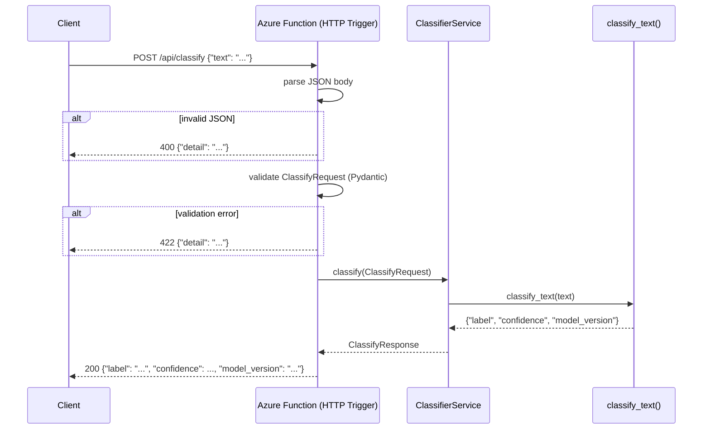
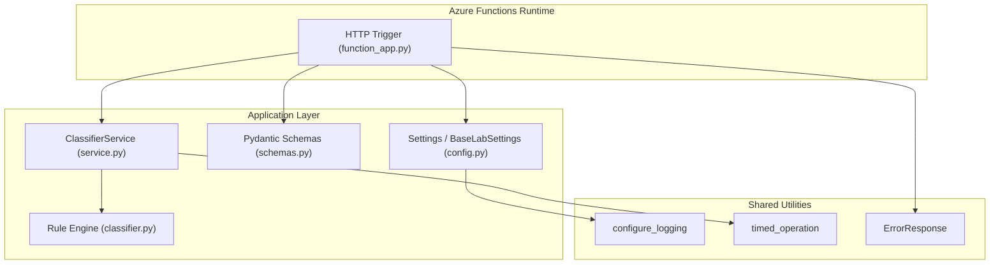

# Lab 02: Architecture

## Request Flow

## Layer Diagram

## Technology Choices

| Choice | Rationale |
|--------|-----------|
| Azure Functions (Consumption plan) | Near-zero idle cost; scales to zero between requests. Right for low-traffic, bursty inference workloads where warm latency is acceptable. |
| Python v2 programming model | Decorator-based routing (`@app.route`) keeps the function definition and binding together, reducing boilerplate. |
| Pydantic v2 validation | Consistent with the rest of the monorepo; provides free input validation, clear error messages, and typed response serialization. |
| Rule-based classifier | Keeps lab scope on the Functions deployment pattern, not model artifacts or training pipelines. |
| `production-labs-shared` | Centralizes config, logging, telemetry, and error schemas so labs stay thin and consistent. |

## Tradeoffs vs Lab 01 (Container Apps)

| Concern | Azure Functions | Azure Container Apps |
|---------|-----------------|----------------------|
| Idle cost | Near-zero (Consumption plan) | Scales to zero but has minimum replicas option |
| Cold start | ~500ms (Python) | Negligible once warm |
| Request duration limit | 5 min (Consumption) | Unlimited |
| Best fit | Bursty, latency-tolerant workloads | Sustained traffic, low-latency requirements |
