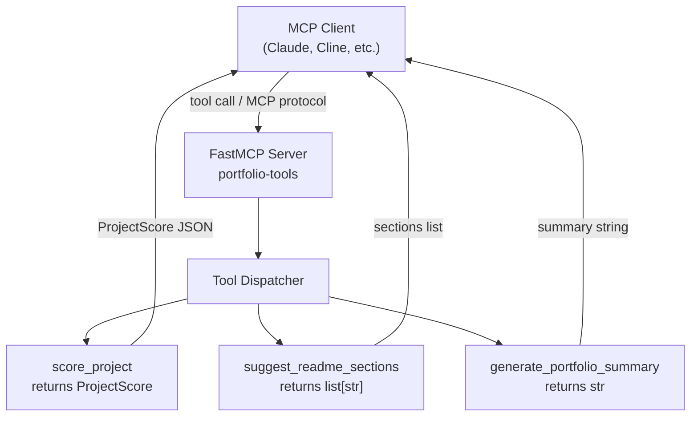
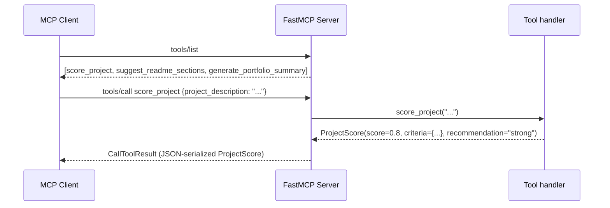

# Architecture: FastMCP Portfolio Tools

## Overview

Lab 03 is a stateless MCP (Model Context Protocol) server built with FastMCP. It exposes three deterministic, rule-based tools that an MCP client (Claude Desktop, Cline, or any compatible host) can call to analyze and document software projects.

## Technology choices

| Concern | Choice | Why |
|---|---|---|
| Protocol | MCP (Model Context Protocol) | Standard interface for LLM tool use |
| Framework | FastMCP 3.x | Decorator-based server with automatic schema generation |
| Transport | stdio (default) / streamable-http (Docker) | stdio for direct LLM integration; HTTP for container-based use |
| Validation | Pydantic v2 | Typed tool responses; FastMCP generates MCP input/output schemas automatically |
| Logging | structlog (via shared) | Structured JSON output consistent with other labs |

## Component diagram



## Request flow



## Tool schemas

### `score_project`

Input: `project_description: str`

Output: `ProjectScore`

```json
{
  "score": 0.8,
  "criteria": {
    "has_api": true,
    "has_tests": true,
    "has_cloud": false,
    "has_ai_ml": true,
    "has_docker": true
  },
  "recommendation": "strong"
}
```

Score is the fraction of criteria matched (0.0 to 1.0). Recommendation is "strong" at >= 0.6.

### `suggest_readme_sections`

Input: `project_type: str` (one of: `api`, `ml`, `rag`, `agent`, or any unknown value)

Output: `list[str]` - base sections plus type-specific additions.

### `generate_portfolio_summary`

Input: `projects: list[str]`

Output: `str` - one-paragraph summary stating the project count and portfolio scope.

## Non-goals

- No persistence: all tool results are stateless and deterministic.
- No LLM calls inside tools: logic is keyword-based to keep the focus on MCP transport and schema design, not model behavior.
- No cloud infrastructure: the server runs locally or in Docker, never deployed to Azure.
