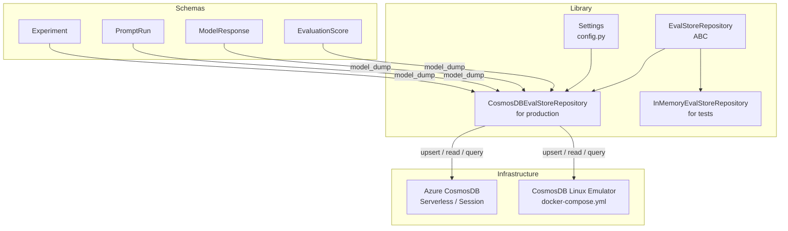
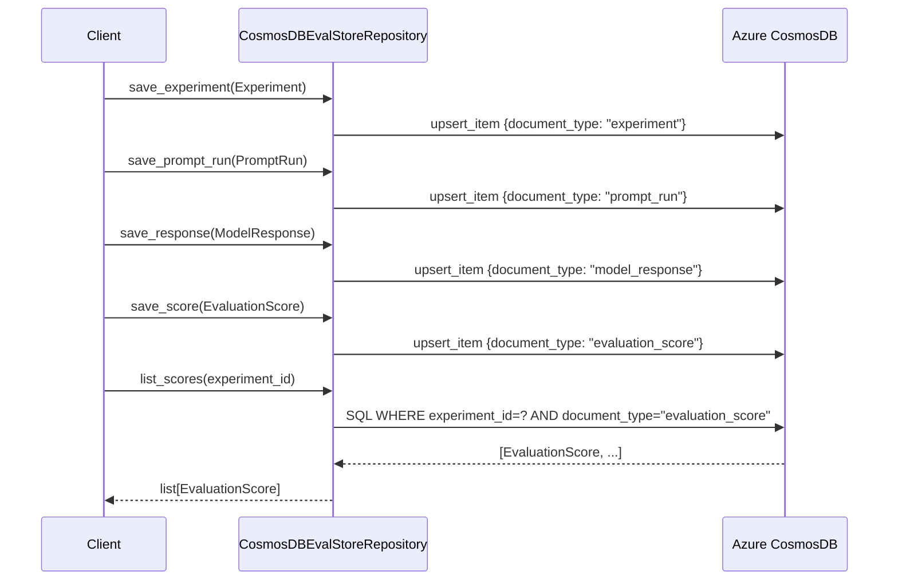
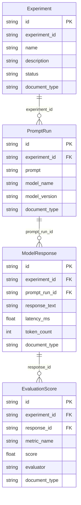

# Architecture: CosmosDB LLM Eval Store

## Component Overview

## Data Flow: Evaluation Lifecycle

## Document Hierarchy

## Technology Decisions

### Single-container, multi-type pattern

All four document types (`experiment`, `prompt_run`, `model_response`, `evaluation_score`) live in
one Cosmos DB container partitioned by `/experiment_id`. This means every document belonging to
one experiment is co-located on the same physical partition, which makes queries like
"all scores for experiment X" zero-cost fan-outs.

The `document_type` field on every schema is required because Cosmos DB SQL does not have a native
type system. Without it, a query for scores would return all documents in the partition.

Trade-off: cross-experiment aggregations (e.g., average score across all experiments) require
`enable_cross_partition_query=True` and are more expensive. For this workload, per-experiment
queries dominate, so this trade-off is acceptable.

### Serverless capacity mode

The infrastructure is provisioned in Serverless mode so there is no minimum cost when the store
is idle. For high-throughput production workloads with sustained RU/s, switching to provisioned
throughput would reduce per-operation cost.

### Repository pattern

`EvalStoreRepository` is an ABC so the library can be tested without a running Cosmos DB instance.
`InMemoryEvalStoreRepository` is used in unit tests; `CosmosDBEvalStoreRepository` is used in
integration tests (via the Docker emulator) and in production. The scripts and smoke test both
use the Cosmos implementation, so any divergence between the two would surface immediately.

### Emulator portability

The CosmosDB Linux Emulator (`mcr.microsoft.com/cosmosdb/linux/azure-cosmos-emulator`) exposes
the identical SQL API as the Azure service. Scripts and integration tests written against the
emulator require no code changes when pointed at Azure; only connection settings change.
