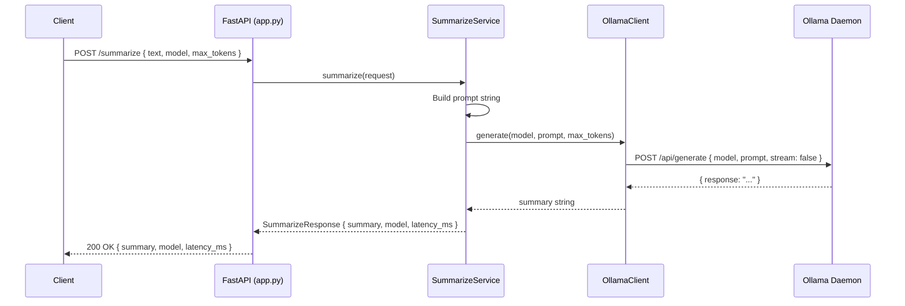
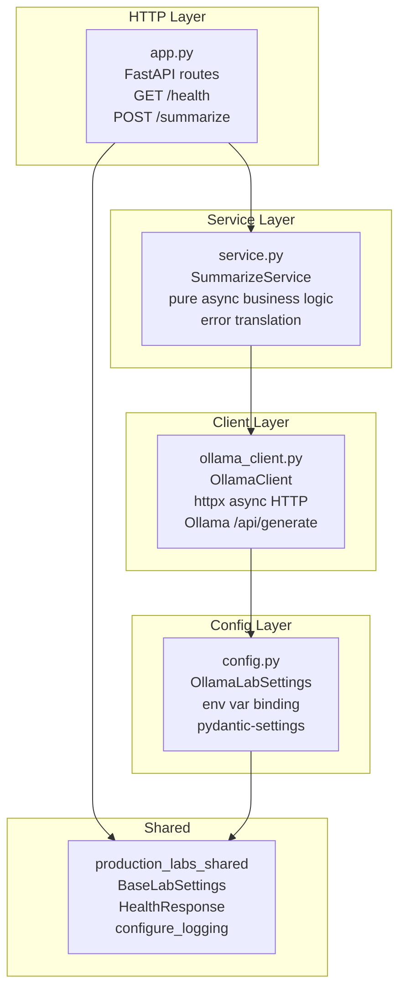

# Lab 05: Architecture

## Request Flow

Error paths:

- Ollama not running: `ConnectError` in `OllamaClient` is caught in `SummarizeService` and raised as HTTP 503.
- Ollama too slow: `TimeoutException` is raised as HTTP 504.
- Invalid request body: Pydantic validation fails before the route handler runs, returning HTTP 422.

## Layer Diagram

## Technology Choices

**FastAPI**: Async-first routing with automatic OpenAPI docs and Pydantic request/response validation.
Chosen over Flask because it handles `async def` route handlers natively, which matters here since
`OllamaClient.generate` is async.

**httpx (async)**: Async HTTP client that integrates cleanly with `async/await`. The synchronous
`requests` library would block the event loop during the Ollama call, degrading concurrency under load.

**Pydantic v2**: Schema validation at the boundary. `SummarizeRequest` enforces `min_length=1` on
`text` and `ge=1, le=2048` on `max_tokens` before the handler is ever called, keeping service.py
free of defensive checks.

**pydantic-settings**: Reads `OLLAMA_BASE_URL`, `OLLAMA_DEFAULT_MODEL`, and `OLLAMA_TIMEOUT_SECONDS`
from environment variables (or `.env` file). Allows the same image to point at different Ollama
instances across local, Docker, and Azure deployments without a rebuild.

**Ollama**: Runs open-weight models (phi3.5, tinyllama) locally via a REST API. No cloud API key
required. The FastAPI wrapper adds production concerns: structured logging, health endpoint,
Pydantic validation, and HTTP error translation.
