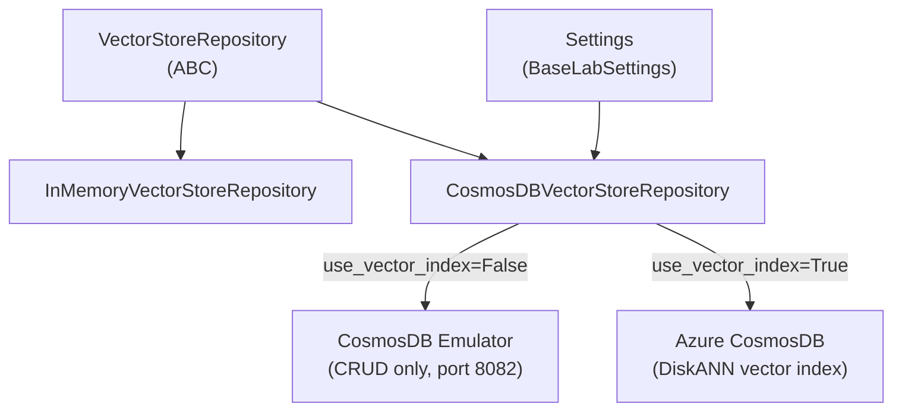
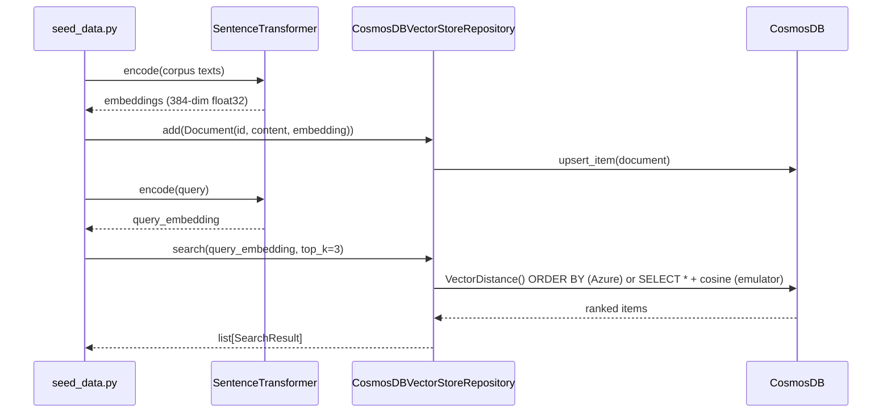

# Lab 06: Architecture

## Component diagram

## Seed and query flow

## Design notes

**DiskANN vs brute-force cosine**

`InMemoryVectorStoreRepository` and the `use_vector_index=False` fallback in `CosmosDBVectorStoreRepository` both compute cosine similarity in Python across all documents. This is fine for corpora under ~1,000 documents. `CosmosDBVectorStoreRepository` with `use_vector_index=True` delegates to Azure Cosmos DB's DiskANN index, which scales to tens of millions of vectors with sub-millisecond latency.

**Emulator limitation**

The CosmosDB Linux emulator does not support `VectorEmbeddingPolicy` or the `VectorDistance()` SQL function. Integration tests always run with `use_vector_index=False`. Only the E2E test (`tests/e2e/`) and deployed smoke test use the DiskANN path.

**Partition key**

The container uses `/id` as the partition key. Each document is its own logical partition since documents do not share a natural grouping key. This matches the serverless capacity mode, which has no cross-partition throughput limit at small scale.

**Embedding model and dimension**

The lab uses `all-MiniLM-L6-v2` from `sentence-transformers` (384-dim, cosine distance). This model runs locally with no API key. The Terraform `dimensions = 384` must stay in sync with this model; using a different model would cause Azure to reject upserts with a dimension mismatch error.
