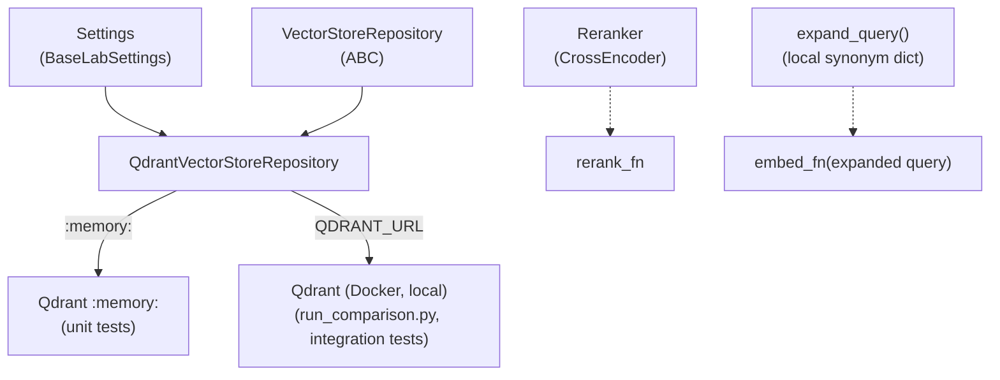
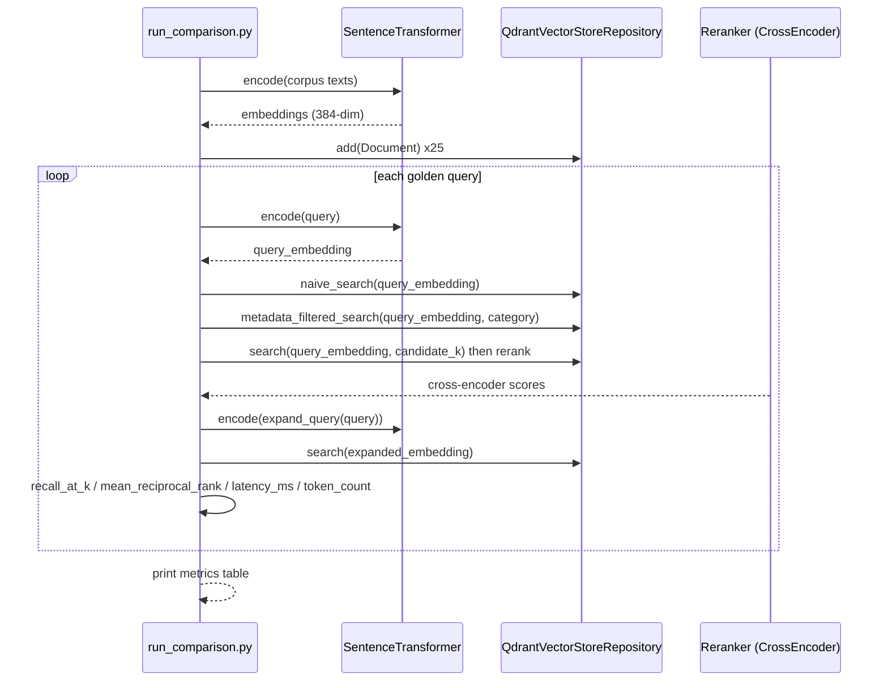

# Lab 07: Architecture

## Component diagram

## Comparison flow

## Design notes

**Qdrant embedded mode vs raw in-memory lists**

The original scaffold operated on raw `list[dict]`, never exercising the
already-declared `qdrant-client` dependency. `QdrantVectorStoreRepository`
wraps `qdrant-client` behind a `VectorStoreRepository` ABC (mirroring lab
06's repository pattern) so metadata filtering uses Qdrant's real payload
`Filter`/`FieldCondition` API instead of a Python-side pre-filter. It
supports two modes: `:memory:` (embedded, no server, used by unit tests for
speed) and a real Qdrant server via Docker (`docker-compose.yml`, used by
`scripts/run_comparison.py` and integration tests) reached over
`QDRANT_URL`. Both are still "local, no cloud dependency" per this lab's
scope, a Docker container on localhost is not a cloud resource.

**Point IDs**

Qdrant requires point IDs to be an unsigned integer or a UUID, not an
arbitrary string. The repository derives a stable `uuid5` from each
document's string ID (`_point_id()` in `repository.py`) and stores the
original ID in the payload, so callers keep using plain string IDs.

**Cross-encoder reranking**

`reranked_search` takes the naive search's top `candidate_k` results and
rescoring them with `sentence-transformers`' `CrossEncoder`
(`cross-encoder/ms-marco-MiniLM-L-6-v2`) — already covered by the existing
`sentence-transformers` dependency, no new dependency, no API key, still
fully local.

**Query expansion without an LLM call**

`expand_query` uses a small, deterministic, local synonym dictionary scoped
to this lab's corpus vocabulary (`query_expansion.py`). An LLM-based
paraphrase/expansion approach was deliberately not used: it would violate
this lab's own "no cloud dependency" scope, and would make results
non-deterministic across runs.

**What's deferred**

Two of the five strategies listed in the project blueprint are not
implemented here: chunk-size comparison (an experiment-design variant, not a
new retrieval algorithm) and LLM-based query expansion (would need a cloud
call). The lab's "done when" bar is "at least three strategies run"; four
are implemented (naive, metadata-filtered, reranked, expanded-query),
comfortably over that bar.

**Corpus and golden queries**

The corpus (`data/wikipedia_corpus.json`) is 25 real Wikipedia article
extracts across 5 distinct categories (machine learning, cooking, history,
sports, astronomy), fetched via `scripts/fetch_wikipedia_corpus.py`
(one-off, stdlib only, not part of any test or CI path — mirrors lab 06's
corpus pattern). Distinct categories make `metadata_filtered_search`
meaningful. `data/golden_queries.json` is hand-curated against this corpus,
including a few queries phrased with colloquial terms (e.g. "AI", "bread",
"soccer") chosen to exercise `expand_query`'s synonym dictionary.
