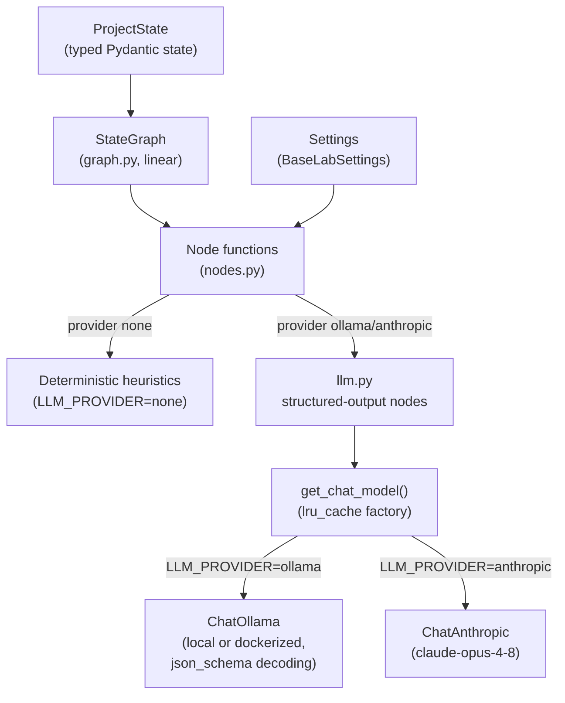
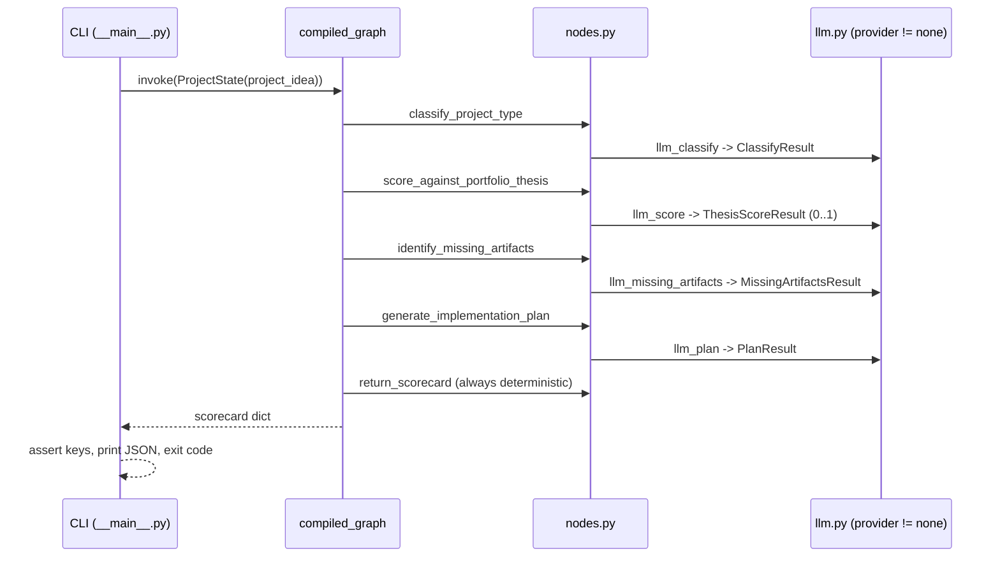

# Lab 08: Architecture

## Component diagram

## Graph flow

## Design notes

**Explicit workflow over black-box agent**

The graph is a fixed, linear `StateGraph` whose nodes each perform one typed
transformation on `ProjectState`. There is no tool loop and no model-driven
control flow: the LLM is used per node as a structured-output function, which
keeps behavior testable and the failure surface per node.

**Three provider tiers behind one dispatch**

`LLM_PROVIDER` selects the tier at the node boundary. `none` (default) runs
keyword heuristics with zero dependencies, which keeps unit tests hermetic
and the CLI usable offline. `ollama` and `anthropic` share one code path:
`get_chat_model()` returns a LangChain chat model and every node calls
`.with_structured_output(PydanticModel)`, so responses are validated objects,
not parsed strings. The heuristics were kept rather than deleted so the
deterministic tier remains a permanent regression baseline.

**Ollama structured output via constrained decoding**

`ChatOllama` defaults to tool calling for structured output, which small
local models (phi3.5, tinyllama) do not support. The ollama branch passes
`method="json_schema"`, using Ollama's constrained decoding so any model
emits schema-valid JSON. The Anthropic branch uses the default tool-based
path, which claude-opus-4-8 handles natively.

**Configuration**

`Settings` extends the shared `BaseLabSettings` and reads both the repo-root
`.env` and the lab-local `.env` (lab-local wins). `ANTHROPIC_API_KEY` flows
from either file through `Settings` into the factory, falling back to the
process environment; empty values are treated as unset.

**Deployment surfaces**

Local: CLI via `python -m langgraph_project_agent`, doubling as the smoke
test. CI per PR: unit tests in the tox gates plus an e2e job against the
Anthropic API. Manual dispatch: Terraform deploys a one-shot agent container
(Azure Container Instance, key as secure env var) whose logs CI asserts, and
an Ollama ACI that integration tests run against; both are destroyed at the
end of every run.
