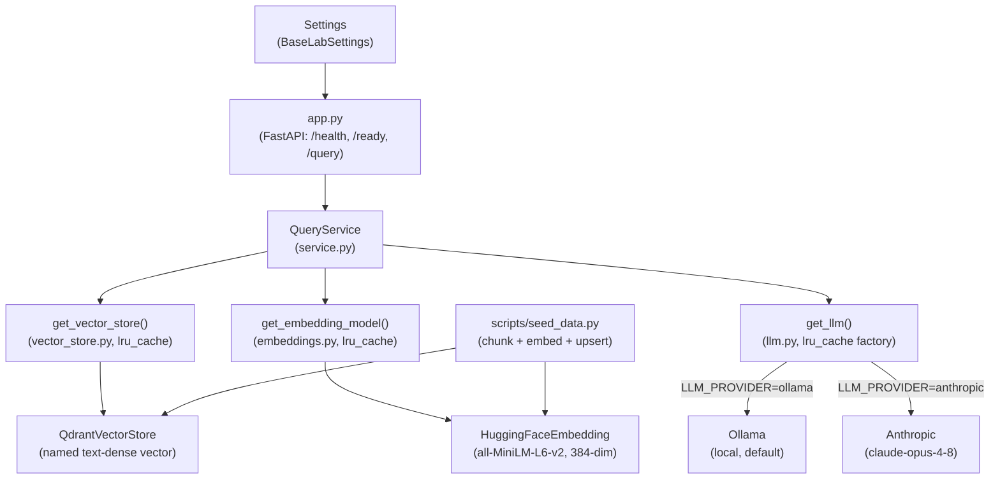
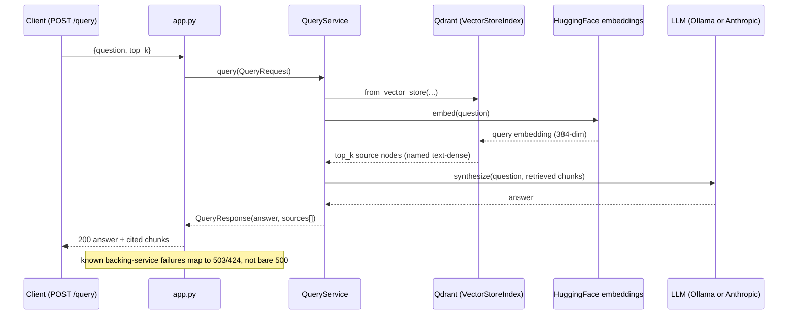

# Lab 09: Architecture

## Component diagram

## Query flow

## Design notes

**Retrieve-and-generate over a shared vector store**

Ingestion (`seed_data.py`) and query (`service.py`) both go through the same
`get_vector_store()` and `get_embedding_model()` factories, so the collection
they write and read cannot drift in embedding model or dimension. The query
path is a standard LlamaIndex `VectorStoreIndex.from_vector_store` plus a query
engine at `similarity_top_k = top_k`; unlike labs 06 and 07 (store or retrieve
only), this lab runs the full retrieve-and-generate loop and returns cited
source chunks.

**Named dense vector**

`QdrantVectorStore` upserts and queries a named dense vector
(`DEFAULT_DENSE_VECTOR_NAME`, "text-dense"), but its non-hybrid auto-create
makes an unnamed vector, so a later `from_vector_store` query fails with "Not
existing vector name error: text-dense". `seed_data.py` creates the collection
explicitly with the named vector, and validates an existing collection's schema
(named vector present, dimension match) so a stale or mismatched collection
fails fast at seed time rather than at query time.

**Two provider tiers behind one dispatch**

`LLM_PROVIDER` selects the generation tier at the `get_llm()` boundary. `ollama`
(default) needs no key and runs a local model; `anthropic` uses the API when a
key is present, falling back to `ANTHROPIC_API_KEY` from the process
environment. Embeddings are always local (`sentence-transformers`), independent
of the LLM tier: Anthropic has no embeddings API, so embedding can never be
provider-dependent, and retrieval quality stays fixed while the generator
changes. The Ollama tier raises `request_timeout` to 180s because CPU inference
plus multi-chunk refine synthesis overruns the 30s default.

**Configuration**

`Settings` extends the shared `BaseLabSettings` and reads both the repo-root
`.env` and the lab-local `.env` (lab-local wins). It carries the provider
selection, the Ollama and Anthropic model names and key, and the Qdrant URL,
collection, and embedding model name.

**Deployment surfaces**

Local: `docker compose` brings up app, ollama, and qdrant; `seed_data.py` loads
the corpus, then `POST /query` answers. CI per PR: unit tests plus mocked
integration in the tox gates, the lab Dockerfile build, and an Anthropic e2e
job. Manual dispatch: Terraform deploys the app on Azure Container Apps
(scale-to-zero) with public Ollama and Qdrant on Container Instances, seeds the
corpus, runs the HTTP smoke test, and destroys all three resources at the end of
every run.
